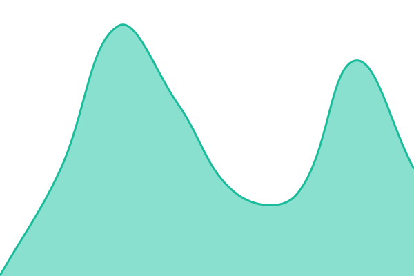

# [📈 Live Status](https://texlyre.github.io/upptime): <!--live status--> **🟩 All systems operational**

This repository contains the open-source uptime monitor and status page for [TeXlyre](https://texlyre.org), powered by [Upptime](https://github.com/upptime/upptime).

With [Upptime](https://upptime.js.org), you can get your own unlimited and free uptime monitor and status page, powered entirely by a GitHub repository. We use [Issues](https://github.com/texlyre/upptime/issues) as incident reports, [Actions](https://github.com/texlyre/upptime/actions) as uptime monitors, and [Pages](https://texlyre.github.io/upptime) for the status page.

<!--start: status pages-->
<!-- This summary is generated by Upptime (https://github.com/upptime/upptime) -->
<!-- Do not edit this manually, your changes will be overwritten -->
<!-- prettier-ignore -->
| URL | Status | History | Response Time | Uptime |
| --- | ------ | ------- | ------------- | ------ |
|  [TeXlyre Home Page (GitHub Pages redirect)](https://texlyre.org/) | 🟩 Up | [texlyre-org.yml](https://github.com/TeXlyre/upptime/commits/HEAD/history/texlyre-org.yml) | 

 287ms
     
 | 

<a href="https://texlyre.github.io/upptime/history/texlyre-org">100.00%</a>
    

|  [TeXlyre App (GitHub Pages)](https://texlyre.github.io/texlyre/) | 🟩 Up | [texlyre-app.yml](https://github.com/TeXlyre/upptime/commits/HEAD/history/texlyre-app.yml) | 

 65ms
     
 | 

<a href="https://texlyre.github.io/upptime/history/texlyre-app">100.00%</a>
    

|  [Templates API (GitHub Pages)](https://texlyre.github.io/texlyre-templates/api/templates.json) | 🟩 Up | [templates-api.yml](https://github.com/TeXlyre/upptime/commits/HEAD/history/templates-api.yml) | 

 119ms
     
 | 

<a href="https://texlyre.github.io/upptime/history/templates-api">100.00%</a>
    

|  [Chelys Recipes (GitHub Pages)](https://texlyre.github.io/chelys-recipes) | 🟩 Up | [chelys-recipes.yml](https://github.com/TeXlyre/upptime/commits/HEAD/history/chelys-recipes.yml) | 

 130ms
     
 | 

<a href="https://texlyre.github.io/upptime/history/chelys-recipes">100.00%</a>
    

|  [TeX Live Endpoint](https://texlive.texlyre.org/pdftex/26/article.cls) | 🟩 Up | [texlive.yml](https://github.com/TeXlyre/upptime/commits/HEAD/history/texlive.yml) | 

 1035ms
     
 | 

<a href="https://texlyre.github.io/upptime/history/texlive">100.00%</a>
    

|  [BusyTeX Endpoint (TeX Live 2026)](https://texlive2026.texlyre.org/26/article.cls) | 🟩 Up | [texlive2026.yml](https://github.com/TeXlyre/upptime/commits/HEAD/history/texlive2026.yml) | 

 793ms
     
 | 

<a href="https://texlyre.github.io/upptime/history/texlive2026">100.00%</a>
    

|  [Repository Proxy](https://proxy.texlyre.org/?url=https%3A%2F%2Fgithub.com%2Frobots.txt) | 🟩 Up | [repository-proxy.yml](https://github.com/TeXlyre/upptime/commits/HEAD/history/repository-proxy.yml) | 

 499ms
     
 | 

<a href="https://texlyre.github.io/upptime/history/repository-proxy">100.00%</a>
    

|  [File Sync (FilePizza)](https://filepizza.texlyre.org/) | 🟩 Up | [filepizza.yml](https://github.com/TeXlyre/upptime/commits/HEAD/history/filepizza.yml) | 

 578ms
     
 | 

<a href="https://texlyre.github.io/upptime/history/filepizza">100.00%</a>
    

|  [File Sync Signaling (FilePizza-PeerJS)](https://peerjs.texlyre.org/texlyre) | 🟩 Up | [filepizza-signaling.yml](https://github.com/TeXlyre/upptime/commits/HEAD/history/filepizza-signaling.yml) | 

 431ms
     
 | 

<a href="https://texlyre.github.io/upptime/history/filepizza-signaling">100.00%</a>
    

|  [Collaboration Signaling (y-webrtc)](https://ywebrtc.texlyre.org/) | 🟩 Up | [ywebrtc-signaling.yml](https://github.com/TeXlyre/upptime/commits/HEAD/history/ywebrtc-signaling.yml) | 

 470ms
     
 | 

<a href="https://texlyre.github.io/upptime/history/ywebrtc-signaling">100.00%</a>
    

<!--end: status pages-->

[**Visit our status website →**](https://texlyre.github.io/upptime)

## 📄 License

- Powered by: [Upptime](https://github.com/upptime/upptime)
- Code: [MIT](./LICENSE) © [Anand Chowdhary](https://anandchowdhary.com)
- Data in the `./history` directory: [Open Database License](https://opendatacommons.org/licenses/odbl/1-0/)
